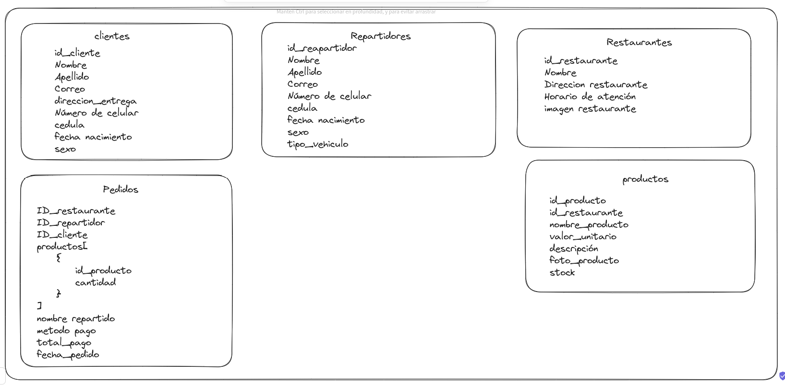

# Rappi Campus 🛵🌮

## Instalacion y uso
Para hacer uso de **Rappi Campus**  se debe tener instalado [GIT](https://git-scm.com/), [Node.js](https://nodejs.org/es/)

> Nota: El proyecto hace uso de la version de nodejs v18.17.0

### Clonar el repositorio
```bash
git clone https://github.com/Kevin2606/rappi_campus.git
```
> Una vez clonado el repositorio accede a la carpeteta del proyecto
### Instalar dependencias
```bash
npm install
```
### Configurar variables de entorno
Crear un archivo .env en la raiz del proyecto
```bash
touch .env
```
> Nota: Este comando solo funciona en sistemas operativos basados en Unix.
> Si estas en Windows puedes crear el archivo .env desde el explorador de archivos

Una vez creado el archivo .env, accede a el desde un editor de texto
Agregar las siguientes variables de entorno
```bash
ATLAS_USER="root"
ATLAS_PASSWORD=""
ATLAS_CLUSTER=""
ATLAS_DB="db_rappi_campus"
JWT_SECRET="secret"
PORT=3000
```
> Nota: En el campo port se puede cambiar a un puerto que no este en uso, por ejemplo 8080, 3000, 5000, etc. El rango de puertos disponibles es de 0 a 65535, se recomienda no utilizar los puertos reservados que van del 0 al 1023, para mas informacion sobre los puertos reservados [click aqui](https://es.wikipedia.org/wiki/Anexo:Puertos_de_red_utilizados_por_protocolos_de_transporte)
>
> Nota: En el campo ATLAS_USER y ATLAS_PASSWORD se debe agregar el usuario y contraseña de la base de datos, si se usa el archivo .env.example se debe cambiar el valor de USER y PASSWORD por los valores de la base de datos que se encuentra en la nube.
> 
> Nota: En el campo JWT_SECRET se debe agregar una cadena de texto que sera utilizada para la generacion de tokens JWT, esta cadena de texto puede ser cualquiera, como el que esta por ejemplo: "secret".
>
> Nota: En el campo ATLAS_CLUSTER se debe agregar el nombre del cluster de la base de datos, si se usa el archivo .env.example se debe cambiar el valor de CLUSTER por el valor de la base de datos que se encuentra en la nube. Por ejemplo: "ATLAS_CLUSTER="cluster0.owv3sij.mongodb.net"

>**Cada cambio en las variables de entorno requiere reiniciar el servidor para que los cambios surtan efecto.**

### Base de datos
En la carpeta **database** se encuentra el archivo **query.mongodb** que contiene el script para crear la base de datos y las tablas necesarias para el funcionamiento del proyecto.

Tambien puedes optar por usar el archivo **.env.example** que contiene las variables de entorno necesarias para la conexion a la base de datos, solo debes cambiar el nombre del archivo a **.env** y esta te conectara a la base de datos que se encuentra en la nube.


### Iniciar el servidor
Para iniciar el servidor se debe ejecutar en la terminal para iniciar el servidor.

```bash
npm run dev
```

### Uso de la plataforma
Para hacer uso de la plataforma se debe contar con herramientas informaticas para la realizacion de pruebas de api como **[Thunder Client](https://www.thunderclient.com/)** o **[Postman](https://www.postman.com/)**, ademas necesitas obtener un token de autenticacion, para esto se debe hacer una peticion GET a la ruta **/auth**.

**NOTA: En la raiz del proyecto, el archivo api.http contiene ejemplos de peticiones para cada endpoint. Puedes hacer uso de cualquiera de las herramientas anteriormente mencionadas, o usar [REST Client](https://marketplace.visualstudio.com/items?itemName=humao.rest-client) y ejecutar cada peticion con un solo click**


### Obtener token de autenticacion
Para la obtencion del token se 

| Método  | Ruta                                   | Descripción                         |
| ------- | -------------------------------------- | ----------------------------------- |
| POST    | `/auth/repartidores/login`                  | Iniciar sesión como repartidor     |
| POST    | `/auth/repartidores/register`               | Registrar un nuevo repartidor       |
| POST    | `/auth/clientes/login`                      | Iniciar sesión como cliente        |
| POST    | `/auth/clientes/register`                   | Registrar un nuevo cliente          |
| POST    | `/auth/restaurantes/login`                  | Iniciar sesión como restaurante     |
| POST    | `/auth/restaurantes/register`               | Registrar un nuevo restaurante    |

Ejemplo:

- Para el registro de un nuevo usuario como registrador se debe hacer una peticion POST a la ruta **/auth/repartidores/register** con el siguiente body:
```json
{
    "nombre": "Luis",
    "contrasena": "123456a",
    "apellido": "Gomeza",
    "correo": "luis_gomeza@gmail.com",
    "numero_celular": "3001234567a",
    "cedula": "33333a",
    "fecha_nacimiento": "1990-01-01",
    "sexo": "M",
    "tipo_vehiculo": "Carro"
}
```

- Para el inicio de sesion de un usuario como registrador se debe hacer una peticion POST a la ruta **/auth/repartidores/login** con el siguiente body:
```json
{
    "correo": "luis_gomeza@gmail.com",
    "contrasena": "123456a"
}
```


El token de autenticacion sera necesario para cada endpoint listado en la seccion siguiente, para hacer uso de estos endpoints se debe agregar el token de autenticacion en el header de la peticion con el nombre **Authorization**.
> Nota: El token de autenticacion tiene una duracion de 1 hora, despues de este tiempo se debe volver a solicitar un nuevo token.
> 
> Tambien las rutas de registro e inicio de sesion tienen un limite de peticiones por hora, si se supera este limite se debe esperar para volver a hacer una peticion.

### Roles y Permisos
La plataforma cuenta con 3 roles: **Repartidor**, **Cliente** y **Restaurante**.

Cada rol tiene permisos diferentes para hacer uso de los endpoints, a continuacion se listaran los endpoints disponibles para cada rol.


| Rol           | Recurso              | Métodos               |
| --------------- | -------------------- | ---------------------- |
| clientes        | `clientes/*`         | POST, GET, PUT         |
| clientes        | `pedidos/*`          | POST, GET, PUT         |
| clientes        | `productos/*`        | GET                    |
| clientes        | `restaurantes/*`     | GET                    |
| clientes        | `repartidores/*`     | GET                    |
| repartidores    | `repartidores/*`     | POST, GET, PUT         |
| repartidores    | `pedidos/*`          | GET                    |
| repartidores    | `restaurantes/*`     | GET                    |
| repartidores    | `productos/*`        | GET                    |
| repartidores    | `clientes/*`         | GET                    |
| restaurantes    | `restaurantes/*`     | POST, GET, PUT         |
| restaurantes    | `pedidos/*`          | GET                    |
| restaurantes    | `productos/*`        | POST, GET, PUT         |
| restaurantes    | `clientes/*`         | GET                    |
| restaurantes    | `repartidores/*`     | GET                    |

### Endpoints

Por cada endpoint se debe agregar el token de autenticacion en el header de la peticion con el nombre **Authorization**.

Ademas se debe agregar el header **Content-Type** con el valor **application/json**.

Finalmente combinar la ruta base con la ruta del endpoint que se desea usar, por ejemplo:

```Bash
http://localhost:3000/repartidores/cedula/33333a
```

#### Repartidores

```Bash
http://localhost:3000/v1/repartidores
```

| Método  | Ruta                                  | Descripción                               |
| ------- | ------------------------------------- | ----------------------------------------- |
| GET     | `/`                                  | Obtener la lista de repartidores          |
| GET     | `/cedula/:cedula`                    | Obtener un repartidor por número de cédula |
| GET     | `/correo/:correo`                    | Obtener un repartidor por dirección de correo electrónico |
| GET     | `/:id`                               | Obtener un repartidor por su ID           |
| POST    | `/`                                  | Crear un nuevo repartidor                 |
| PUT     | `/:id`                               | Actualizar la información de un repartidor por su ID |


#### Pedidos
```Bash
http://localhost:3000/pedidos
```
| Método  | Ruta                                   | Descripción                               |
| ------- | -------------------------------------- | ----------------------------------------- |
| GET     | `/`                                    | Obtener la lista de pedidos               |
| GET     | `/:id`                                 | Obtener un pedido por su ID               |
| GET     | `/cliente/:id`                         | Obtener pedidos por cliente (por su ID)   |
| GET     | `/repartidor/:id`                      | Obtener pedidos por repartidor (por su ID)|
| GET     | `/restaurante/:id`                     | Obtener pedidos por restaurante (por su ID)|
| POST    | `/`                                    | Crear un nuevo pedido                     |
| PUT     | `/:id`                                 | Actualizar la información de un pedido por su ID |


#### Restaurantes
```Bash
http://localhost:3000/restaurantes
```

| Método  | Ruta                                   | Descripción                               |
| ------- | -------------------------------------- | ----------------------------------------- |
| GET     | `/`                                    | Obtener la lista de restaurantes          |
| GET     | `/:id`                                 | Obtener un restaurante por su ID          |
| POST    | `/`                                    | Crear un nuevo restaurante                |
| PUT     | `/:id`                                 | Actualizar la información de un restaurante por su ID |


#### Clientes
```Bash
http://localhost:3000/clientes
```
| Método  | Ruta                             | Descripción                               |
| ------- | -------------------------------- | ----------------------------------------- |
| GET     | `/getClient/:id`                 | Obtener un cliente por su ID              |
| GET     | `/getAllClient`                   | Obtener la lista de todos los clientes     |
| POST    | `/create`                         | Crear un nuevo cliente                     |
| PUT     | `/update/:id`                     | Actualizar la información de un cliente por su ID |

#### Productos
```Bash
http://localhost:3000/productos
```

| Método  | Ruta                                | Descripción                                         |
| ------- | ----------------------------------- | --------------------------------------------------- |
| GET     | `/getProduct/:id`                  | Obtener un producto por su ID                        |
| GET     | `/getAllProduct`                   | Obtener la lista de todos los productos             |
| GET     | `/getProductByRestaurant/:id`      | Obtener productos por ID de restaurante              |
| POST    | `/create`                          | Crear un nuevo producto                              |
| PUT     | `/update/:id`                      | Actualizar la información de un producto por su ID   |


### Modelo Base de Datos



La investigacion realizada sobre Rappi y otros se encuentra en el siguiente [enlace](investigacion/README.md)

### Roadmap - Tareas pendientes
Se plantea la siguiente lista de tareas pendientes para el proyecto:

- [ ] Que el restaurante pueda editar y eliminar productos que el mismo creo. (Ningún otro restaurante debería poder modificar los productos de otros restaurantes)
- [ ] Que solo se puedan ver los pedidos que le interesen al usuario, por ejemplo:
    - Si soy cliente solo deseo ver mis pedidos
    - Si soy repartidor solo deseo ver los pedidos en los que participe
    - Si soy restaurante solo deseo ver los pedidos que vendi

- [ ] Cómo usuarios de la aplicación, que solo puedan ellos actualizar y eliminar sus propios datos

- [ ] Eliminar las consultas que se consideren innecesarias
- [ ] Implementar verificacion del body en el controller


## Autor

- Kevin Gallardo - [@Kevin2606](https://github.com/Kevin2606)
- Gerson Hernandez - [@GersonHdz](https://github.com/gersonhdz8)